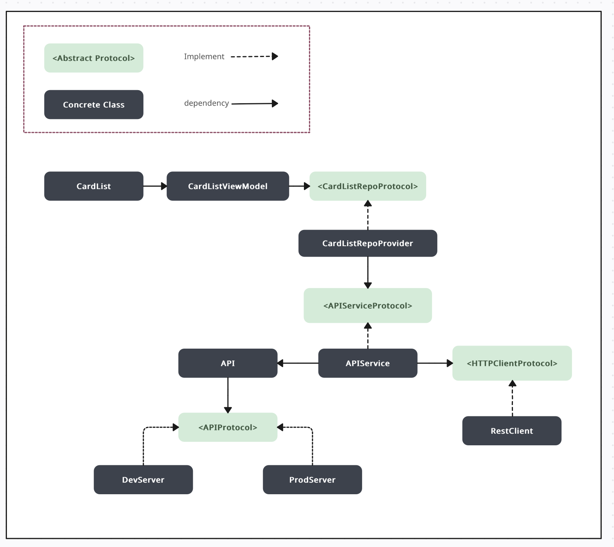
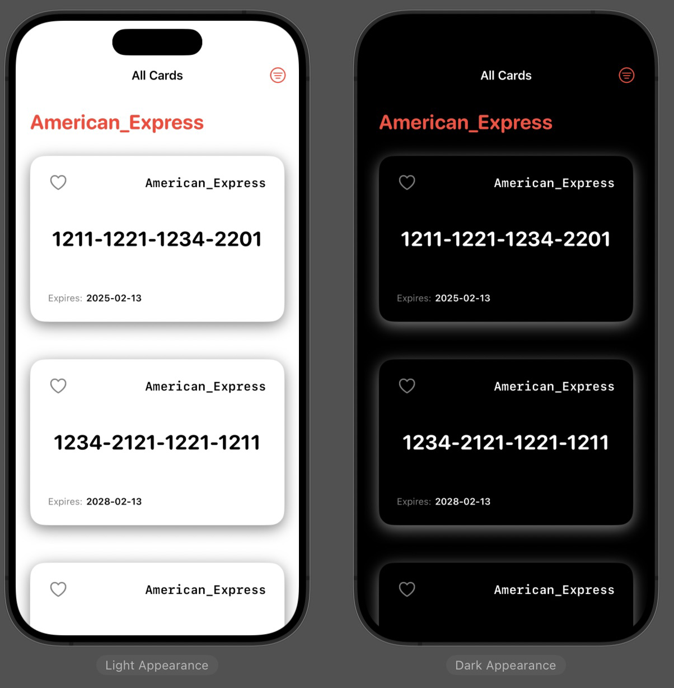
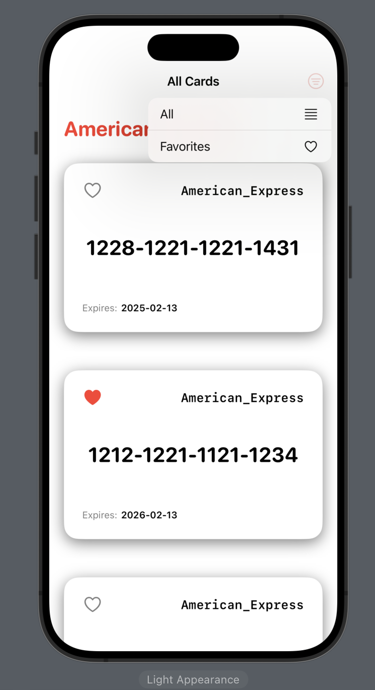
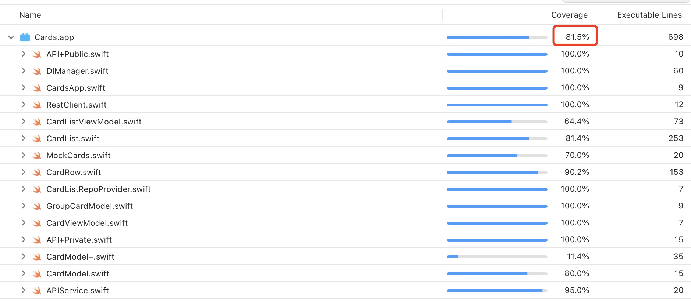

# Overall

The project  (0 warnning, Xcode15.2) was built on Clean architecture, MVVM pattern, and SOLID principles. It implements dependency injection of abstract interfaces (protocols) with **Swinject**, covering a test coverage of **81.5%**.

### Specification

- [x] Display the fetched cards

- [x] Sort/Group cards by type

- [x] Option to bookmark or save cards

- [x] Proper error handling and display appropriate error messages if the API’s fail.

- [x] (81.5% test coverage) XCUnitTests/XCUITests

### Functionalities

- [x] Tests 
  - [x] Unit Tests
  - [x] UI Tests  
  
- [x] Best practice design patterns 
  - [x] Clean architecture
  - [x] MVVM pattern	
  
- [x] Clean Code 
  - [x] SOLID principles

### Architecture diagram:

### ScreenShots:

Support Dark mode by configuring custom color assets using Xcode’s asset editor.

### Test Coverage

The overall test coverage is 81.5%.

